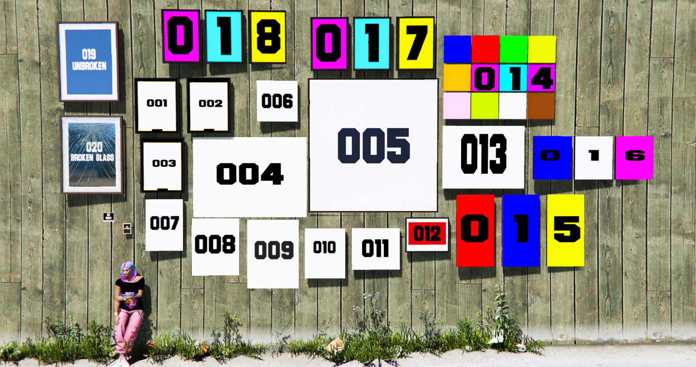
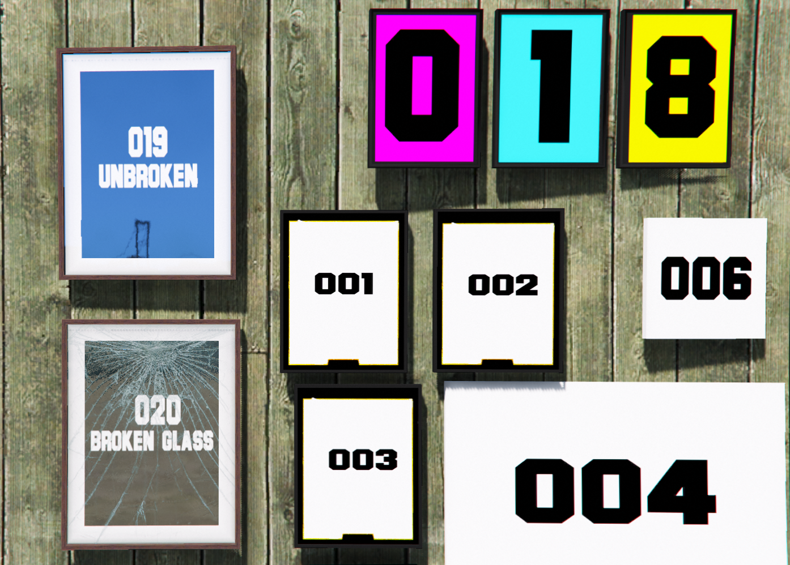
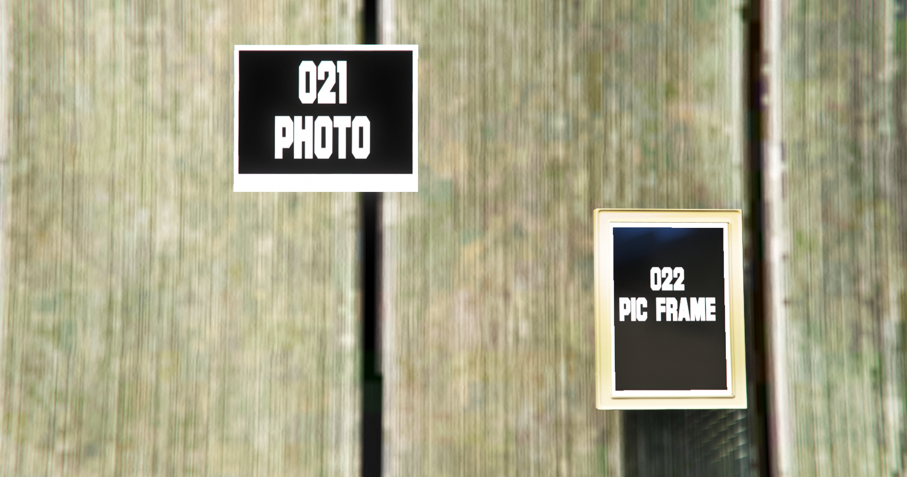
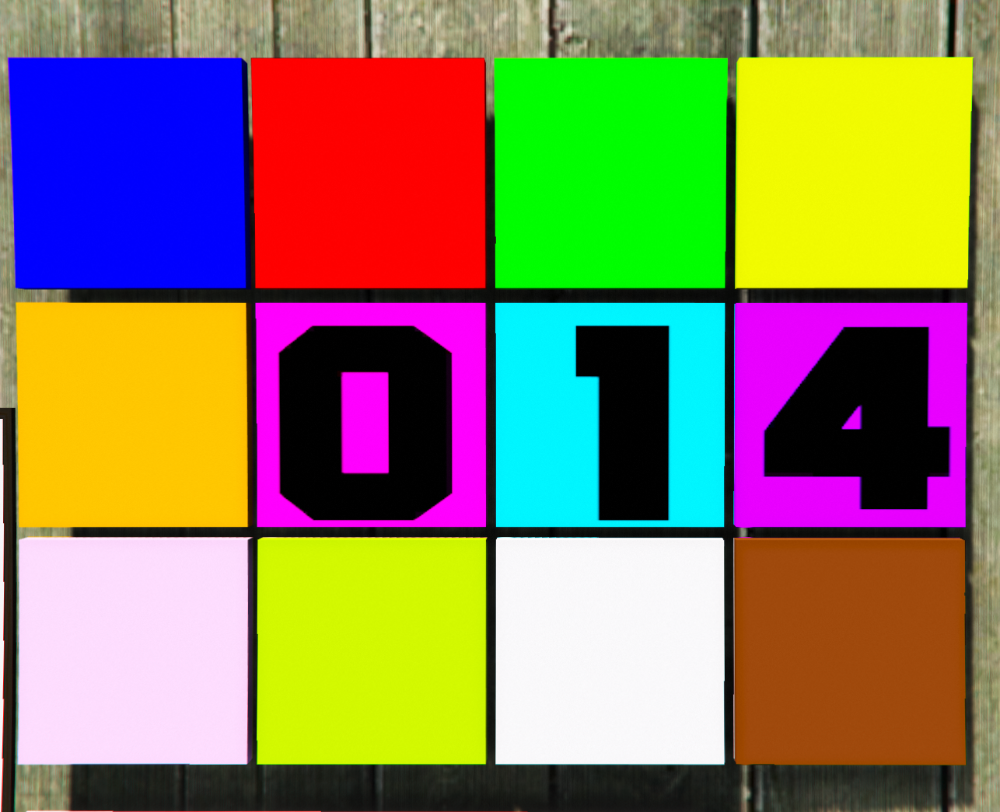
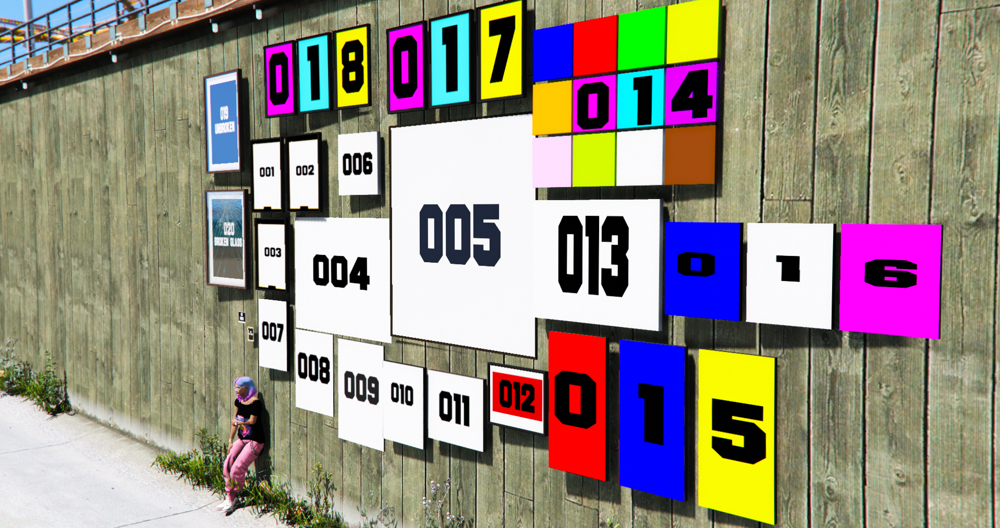
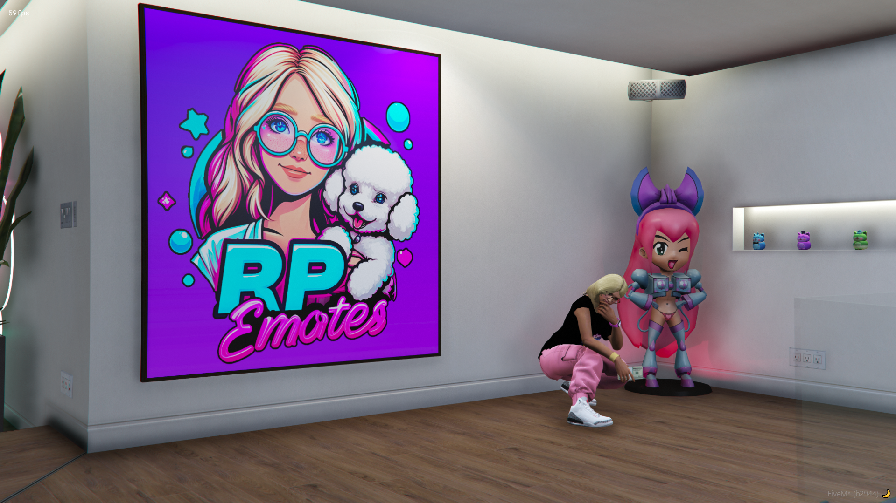
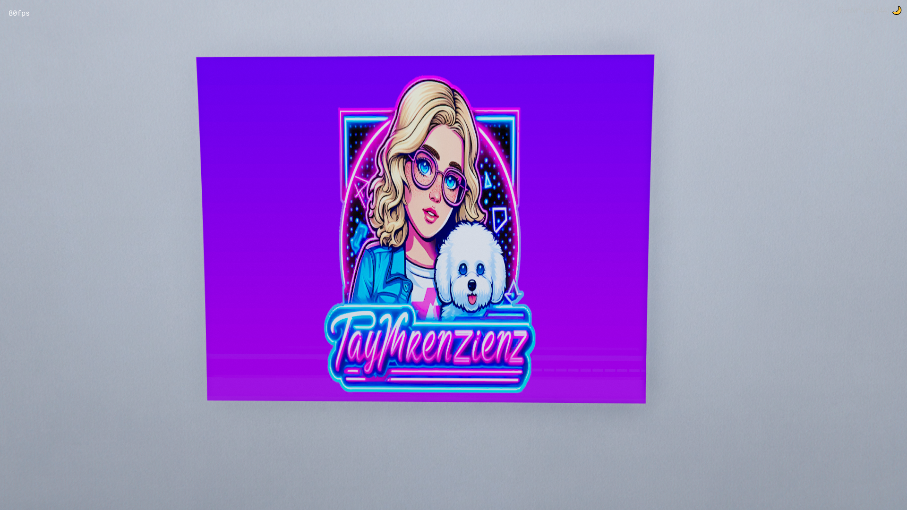
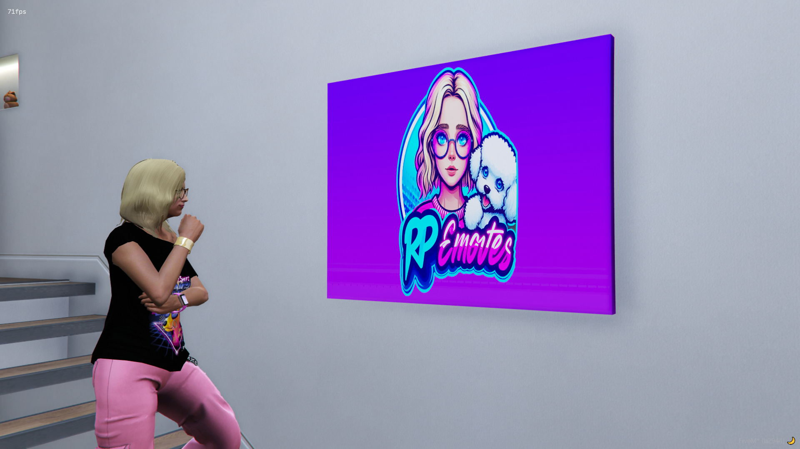

<h1 align="center">🎨 Tay's Art Props 🎨</h1>

<h2 align="center">🖼️Add On Props For FiveM 🖼️</h2>

<h2 align="center">DO NOT REUPLAOD OR SELL WITHOUT MY CONSENT</h2>

  
  
  

# Retextured Art Props For Your Mapping Convenience

---------------------------------------

# Screenshots

| | | |
|-|-|-|
|  |  |  |
|  |  |  |
|  |  |  |

**Thanks for downloading and checking out my art pack!**

This is a little project I slapped together after I wanted to customize some interiors with my own artwork. Few hours digging through OpenIV, finding the props, retexturing them and finally releasing them to the public free of charge.

---------------------------------------

<h1 align="center">FEATURES 🌟:</h1>

  <b>prop_tay_wallart_001 PORTRAIT PHOTO FRAME</b>

  <b>prop_tay_wallart_002 PORTRAIT PHOTO FRAME</b>

  <b>prop_tay_wallart_003 PORTRAIT PHOTO FRAME</b>

  <b>prop_tay_wallart_004 LANDSCAPE LARGE CANVAS</b>

  <b>prop_tay_wallart_005 SQUARE, LARGE WITH FRAME</b>

  <b>prop_tay_wallart_006 SMALL CANVAS LANDSCAPE ART</b>

  <b>prop_tay_wallart_007 SMALL CANVAS PORTRAIT ART</b>

  <b>prop_tay_wallart_008 SMALL CANVAS PORTRAIT ART</b>

  <b>prop_tay_wallart_009 MEDIUM PORTRAIT CANVAS ART</b>

  <b>prop_tay_wallart_010 SMALL SKINNY CANVAS LANDSCAPE ART</b>

  <b>prop_tay_wallart_011 MEDIUM CANVAS PORTRAIT ART</b>

  <b>prop_tay_wallart_012 SMALL LANDSCALE FRAMED ART</b>

  <b>prop_tay_wallart_013 MEDIUM CANVAS PORTRAIT ART</b>

  <b>prop_tay_wallart_014 MEDIUM CANVAS WITH 12 PHOTO OPS, LANDSCAPE ART</b>

  <b>prop_tay_wallart_015 MEDIUM LANDSCAPE ART, 3 PHOTO OPS</b>

  <b>prop_tay_wallart_016 MEDIUM CANVAS, 3 PHOTO OPS, PORTRAIT</b>

  <b>prop_tay_wallart_017 MEDIUM FRAMED MOVIE POSTERS, 3 PHOTO OPS, LANDSCAPE</b>

  <b>prop_tay_wallart_018 MEDIUM FRAMED MOVIE POSTERS, 3 PHOTO OPS, LANDSCAPE</b>

  <b>prop_tay_wallart_019 MEDIUM FRAMED PORTRAIT WITH GLASS</b>

  <b>prop_tay_wallart_020 MEDIUM FRAMED PORTRAIT WITH BROKEN GLASS</b>

  <b>prop_tay_wallart_021 SUPER SMALL POLAROID PHOTO</b>

  <b>prop_tay_wallart_022 SUPER SMALL PHOTO FRAMED BEDSIDE TABLE</b>

---------------------------------------

<h1 align="center">INSTALLATION INSTRUCTIONS 🌟:</h1>

- Download the zip folder

-  Ectract it

-  Remove `-master` from its name

-  Add it to your server

-  Edit the server.cfg and add `Ensure TaysArtProps`

# You will need to use CodeWalker or a mapping program / script to spawn and add these to your MLOs / maps.
